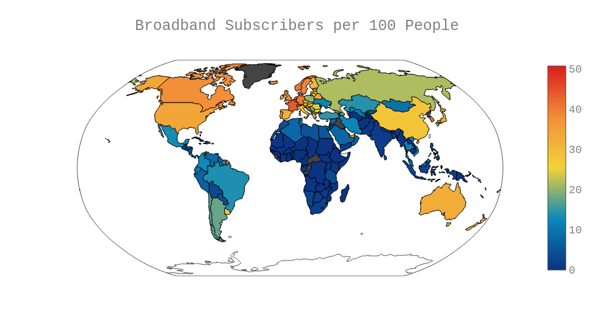

# Mapping the Internet

We see the world as fundamentally improved by technology. However, technology does not in itself solve problems. All too often, improvements for the richest facets of society do not reach the poor. Despite the ubiquity of smart phones in the industrialized world, more than 1/2 of the global population does not have even basic access to the Internet. As of 2016, [The International Telephone Union](http://www.itu.int/en/ITU-D/Statistics/Documents/facts/ICTFactsFigures2016.pdf), in it's annual report on the matter, showed that only 48% of the world has access to the Internet. As you might expect, that also falls along traditional lines of class, race, and gender. While 75% of Africans are unconnected to the 'Net, only 21% of Europeans are. Women are 12% more likely to be without access than men. Only 16% of people in less developed countries use the Internet while rural folks are almost twice as likely to be without access when compared to their urban counterparts.

<!---more--->

To solve that, we have to think in ways that are anti-oppressive, intersectional, and explicitly aware of privilege. We can look to projects like One Laptop per Child which, with good intentions, was unable to solve the crises of poverty. According to [The World Bank](https://blogs.worldbank.org/impactevaluations/one-laptop-per-child-is-not-improving-reading-or-math-but-are-we-learning-enough-from-these-evaluati) recognizes that despite 10s of millions of distributed laptops, giving children out-of-context technology does not improve their math or reading scores. Certainly, standardized test scores are not the end-all, be-all of education metrics, but they are all we have. The only thing that OLPC did improve was the children's engagement with technology. This is should be obvious--giving children computers makes them more familiar with computers. What it doesn't do, however, is change anything structurally.

These problems are not unique to the internet, but indistinguishable from the problems of modern capitalism as a whole. Notice how liberal democracies like Switzerland, France, Denmark, and the United Kingdom have the highest penetration of fixed broadband. These countries have among the best [GDP per capita.](https://www.cia.gov/library/publications/the-world-factbook/rankorder/2004rank.html) This is no coincidence as every dollar of investment in internet infrastructure produces a host of new benefits for the community--increased access to education, a more liquid economy, and the potential to grow and expand that infrastructure. The point of this website, and the decentralized internet more generally is to bring The Next BIllion people online, from those places on the map that could seriously use some investment in education and infrastructure. And this time, the internet wil not be censored of stifled by the whims of politicians. It will be built on open source, encrypted protocols that keep its users safe from even the most repressive of regimes.

One remarkable thing about the internet is that, in general, the [Net interprets censorship as damage and routes around it."](http://www.toad.com/gnu/). That is why repressive regimes control the highest tiers of the internet. Notice how places like Syria, Libya, and Iran have only a single Internet Exchange Point. That makes [it easy for government censors to filter and restrict content.](https://rsf.org/en/ranking) For local populations that could mean they lose access to essential services like [encrypted messengers](https://www.engadget.com/2016/12/20/egypt-blocks-signal/), [Facebook](http://www.reuters.com/article/us-syria-facebook-idUSOWE37285020071123), or even [Wikipedia.](https://en.wikipedia.org/wiki/2017_block_of_Wikipedia_in_Turkey) In our upcoming posts, you will see why decentralized technology provides a method to route around censorship, how it has the potential to allow anyone to participate in providing access to their community, and how it overthrows 20th century notions of capital.